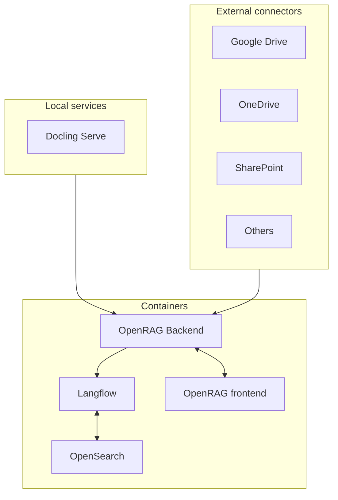

OpenRAG is an open-source package for building agentic RAG systems that integrates with a wide range of orchestration tools, vector databases, and LLM providers.

OpenRAG connects and amplifies three popular, proven open-source projects into one powerful platform:

* [Langflow](https://docs.langflow.org): Langflow is a versatile tool for building and deploying AI agents and MCP servers. It supports all major LLMs, vector databases, and a growing library of AI tools. 

* [OpenSearch](https://docs.opensearch.org/latest/): OpenSearch is a community-driven, Apache 2.0-licensed open source search and analytics suite that makes it easy to ingest, search, visualize, and analyze data.

* [Docling](https://docling-project.github.io/docling/): Docling simplifies document processing, parsing diverse formats — including advanced PDF understanding — and providing seamless integrations with the gen AI ecosystem. 

OpenRAG builds on Langflow's familiar interface while adding OpenSearch for vector storage and Docling for simplified document parsing, with opinionated flows that serve as ready-to-use recipes for ingestion, retrieval, and generation from popular sources like Google Drive, OneDrive, and Sharepoint.

What's more, every part of the stack is swappable. Write your own custom components in Python, try different language models, and customize your flows to build an agentic RAG system.

Ready to get started? [Install OpenRAG](/install) and then run the [Quickstart](/quickstart) to create a powerful RAG pipeline.

## OpenRAG architecture

OpenRAG deploys and orchestrates a lightweight, container-based architecture that combines **Langflow**, **OpenSearch**, and **Docling** into a cohesive RAG platform.



The **OpenRAG Backend** is the central orchestration service that coordinates all other components.

**Langflow** provides a visual workflow engine for building AI agents, and connects to **OpenSearch** for vector storage and retrieval.

**Docling Serve** is a local document processing service managed by the **OpenRAG Backend**.

**Third Party Services** like **Google Drive** connect to the **OpenRAG Backend** through OAuth authentication, allowing synchronication of cloud storage with the OpenSearch knowledge base.

The **OpenRAG Frontend** provides the user interface for interacting with the system.

## Performance expectations

On a local VM with 7 vCPUs and 8 GiB RAM, OpenRAG ingested approximately 5.03 GB across 1,083 files in about 42 minutes.
This equates to approximately 2.4 documents per second.

You can generally expect equal or better performance on developer laptops and significantly faster on servers.
Throughput scales with CPU cores, memory, storage speed, and configuration choices such as embedding model, chunk size and overlap, and concurrency.

This test returned 12 errors (approximately 1.1%).
All errors were file‑specific, and they didn't stop the pipeline.

Ingestion dataset:

* Total files: 1,083 items mounted
* Total size on disk: 5,026,474,862 bytes (approximately 5.03 GB)

Hardware specifications:

* Machine: Apple M4 Pro
* Podman VM:
  * Name: `podman-machine-default`
  * Type: `applehv`
  * vCPUs: 7
  * Memory: 8 GiB
  * Disk size: 100 GiB

Test results:

```text
2025-09-24T22:40:45.542190Z /app/src/main.py:231 Ingesting default documents when ready disable_langflow_ingest=False
2025-09-24T22:40:45.546385Z /app/src/main.py:270 Using Langflow ingestion pipeline for default documents file_count=1082
...
2025-09-24T23:19:44.866365Z /app/src/main.py:351 Langflow ingestion completed success_count=1070 error_count=12 total_files=1082
```

Elapsed time: ~42 minutes 15 seconds (2,535 seconds)

Throughput: ~2.4 documents/second